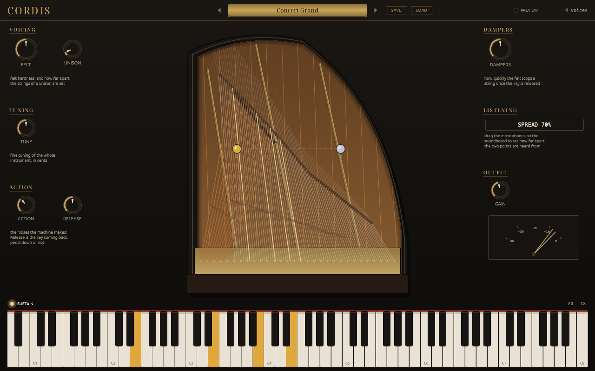
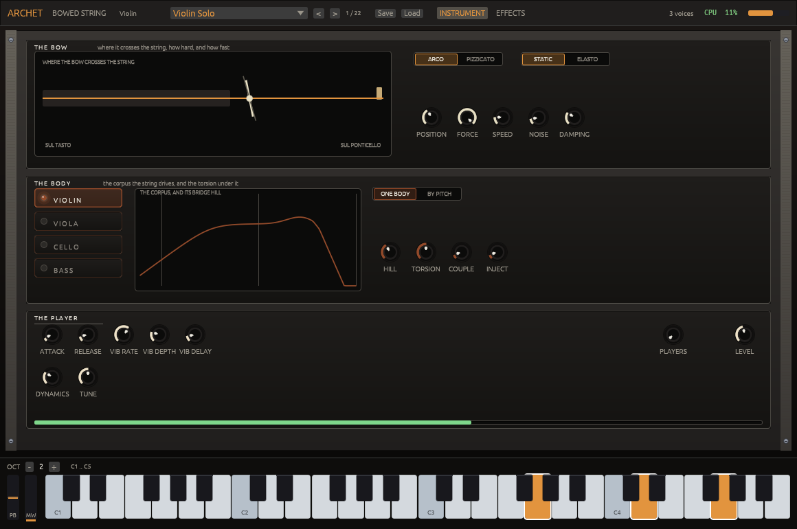
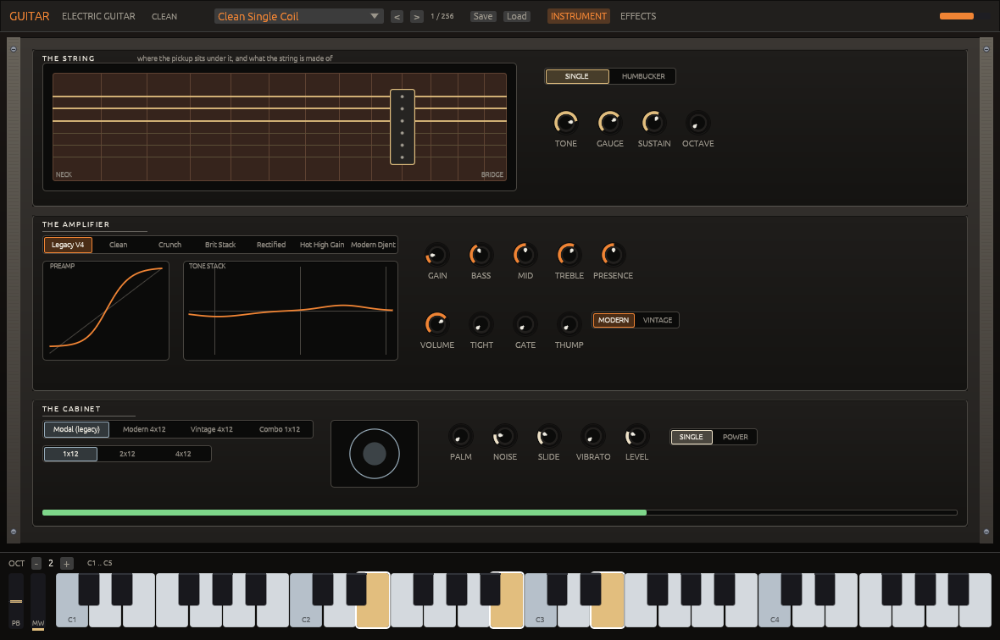

# Phonix Audio

Instruments built from the physics and the literature: VST3 and CLAP plugins,
and a sequencer that hosts them.

The string, the bore and the plate are simulated, so decay, unison beating and
resonance follow from that chain rather than from settings. Each instrument
names the published work it implements, paper by paper, and measures itself
against recordings; what does not yet match is written down beside the code.

## Phonix Piano

A grand piano built from the physics, not from samples: modal strings under a
computed hammer contact, unisons coupled through the bridge, the soundboard in
the loop. The editor is the instrument seen from above; the microphones are
where the model listens to the plate.

[Source, measurements and limitations](https://github.com/phonix-audio/piano)
and [nightly Linux and Windows builds](https://github.com/phonix-audio/piano/releases),
VST3 and CLAP, MIT or Apache-2.0. Nothing is versioned yet: the nightly is the
head of main, built.

## Archet

A bowed string built from the physics, not from samples: violin, viola, cello
and double bass, a modal string under a bow or a finger, bodies of measured
modes, arco and pizzicato, solo or as a section. The editor is the bow on the
string, the body and the player, with the effects the patch carries behind a
switch.

[Source, measurements and limitations](https://github.com/phonix-audio/archet)
and [nightly Linux and Windows builds](https://github.com/phonix-audio/archet/releases),
VST3 and CLAP, MIT or Apache-2.0. Nothing is versioned yet: the nightly is the
head of main, built.

## Guitar

An electric guitar built from a model, not from samples: an extended
Karplus-Strong string under a pick, a tube amplifier in cascaded stages
with seven voicings from clean to modern high gain, and procedural
speaker cabinets. Two hundred and fifty-six presets, and every control a
host parameter; the editor is the string, the pickup and the amplifier,
with the effects the patch carries behind a switch.

[Source, measurements and limitations](https://github.com/phonix-audio/guitar)
and [nightly Linux and Windows builds](https://github.com/phonix-audio/guitar/releases),
VST3 and CLAP, MIT or Apache-2.0. Nothing is versioned yet: the nightly is the
head of main, built.

## Coming

Physical models, emulations of instruments that exist, synthesizers, drums and
voice, all on one shared toolkit; and a sequencer with an arrangement, a mixer
and a modulation matrix that reaches any parameter of any track. Each one goes
public when it stands alone, builds from a clone, and says what it does not do.
