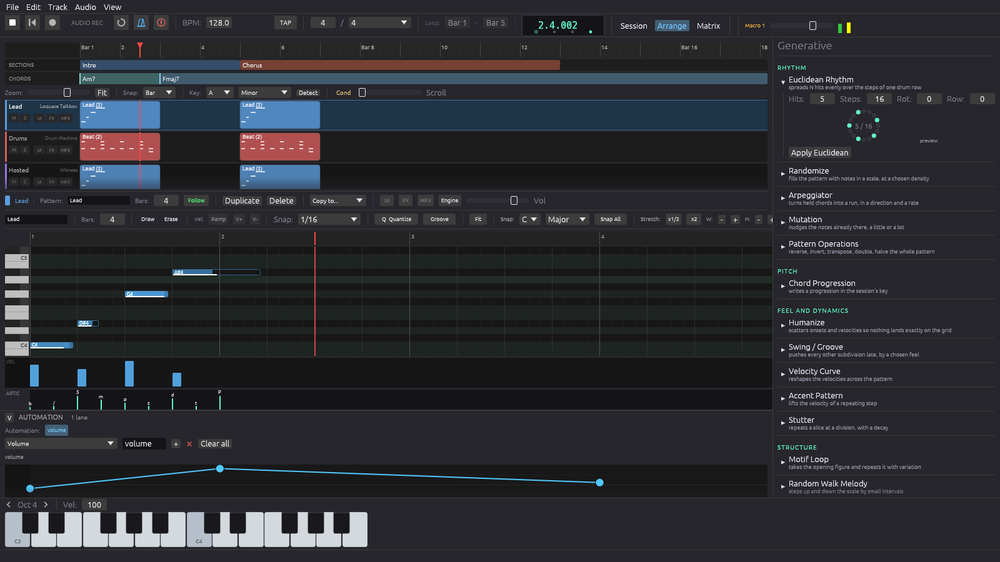

# Phonix Audio

Instruments built from the physics and the literature, each one a VST3 and CLAP
plugin in its own repository, and a sequencer that hosts them.

**The instrument is the interface.** An editor is a drawing of the object it
models, and its parts are the controls. Every forward map has its inverse,
round-trip tested: that is what makes a drawn shape a control and not a picture.

## The sequencer

[**phonix**](../../phonix) hosts every plugin here. Tracks, patterns, a clip
launcher, an arrangement, a mixer with group buses and sends, and a modulation
matrix that reaches any parameter of any track.

## Physical models

The string, the bore and the plate are simulated; decay, unison beating and
resonance follow from that chain rather than from settings.

| | |
|---|---|
| [cordis](../../cordis) | grand piano |
| [archet](../../archet) | bowed strings and harpsichord |
| [souffle](../../souffle) | wind and brass |
| [guitar](../../guitar) | electric guitar, amplifier and cabinet |
| [bass](../../bass) | electric bass |
| [orgue](../../orgue) | tonewheel drawbar organ, through a Leslie |

## Emulations

| | |
|---|---|
| [tb303](../../tb303) | acid bassline synthesizer |
| [vcs3](../../vcs3) | semi-modular monosynth, pin matrix |
| [vp330](../../vp330) | Roland VP-330: strings, choir, vocoder |
| [mellotron](../../mellotron) | tape-replay keyboard |

## Synthesizers

| | |
|---|---|
| [polaris](../../polaris) | virtual analog |
| [solstice](../../solstice) | four-operator FM |
| [pulsar](../../pulsar) | wavetable |
| [strata](../../strata) | four engines in one voice |
| [magma](../../magma) | techno bass and lead |
| [atmosphera](../../atmosphera) | ambient pad that moves on its own |
| [aurora](../../aurora) | cinematic evolving pads |
| [nebula](../../nebula) | generative, eight autonomous layers |
| [grain](../../grain) | granular |
| [spectral](../../spectral) | spectral resynthesis |
| [sampler](../../sampler) | SFZ multisample |

## Drums

| | |
|---|---|
| [techno-kick](../../techno-kick) | kick designer |
| [drum-machine](../../drum-machine) | drum machine, step sequencer |
| [plexus](../../plexus) | generative drum machine |

## Voice

| | |
|---|---|
| [singer](../../singer) | singing voice, from text and a melody |
| [chorale](../../chorale) | MBROLA diphone choir |
| [loquace](../../loquace) | formant synthesis, talkbox, vocoder |
| [aria](../../aria) | operatic solo voice, FOF granular |
| [trancevoice](../../trancevoice) | trance choir |
| [harmonizer](../../harmonizer) | vocal harmonizer, pitch-tracked |

## Effects

| | |
|---|---|
| [fx-rack](../../fx-rack) | eight-slot stereo chain |
